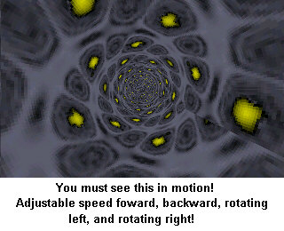



## Textured 3D Tunnel Effect, Real Time Rendering, 70fps on p450, Adjustable Speed/Rotation \*Must See\!\*

### Description

I'm re-posting this because I've fixed a few minor things and made a few minor improvements. This demo runs at about 70 fps on my Pentium 3 450mhz. One executable runs in a window, the other runs fullscreen. It is a simple textured tunnel effect. The texture is wrapped around the tunnel and the bitmap is scrolled to simulate motion through the tunnel or rotation in the tunnel. The code involves methods that provide for very fast graphical manipulation, including lookup tables with mathematical formulas and pointers to a bitmap. The code includes gaussian blurring to smooth the texture and pointers to quickly change the screen. You can change the tunnels texture in the code. To exit the program, double click on the screen. Please vote for this project and leave a comment! I don't care if you give it a bad vote, just vote what you think... I really like to see what people think of it in general.
 
### More Info
 

             |
---                |---
**Submitted On**   |2000-06-28 00:43:34
**By**             |[Rom](https://github.com/Planet-Source-Code/PSCIndex/blob/master/ByAuthor/rom.md)
**Level**          |Intermediate
**User Rating**    |4.7 (28 globes from 6 users)
**Compatibility**  |VB 3\.0, VB 4\.0 \(16\-bit\), VB 4\.0 \(32\-bit\), VB 5\.0, VB 6\.0, VB Script, ASP \(Active Server Pages\) 
**Category**       |[Miscellaneous](https://github.com/Planet-Source-Code/PSCIndex/blob/master/ByCategory/miscellaneous__1-1.md)
**World**          |[Visual Basic](https://github.com/Planet-Source-Code/PSCIndex/blob/master/ByWorld/visual-basic.md)
**Archive File**   |[CODE\_UPLOAD72276282000\.zip](https://github.com/Planet-Source-Code/rom-textured-3d-tunnel-effect-real-time-rendering-70fps-on-p450-adjustable-speed-rotation-__1-9326/archive/master.zip)

